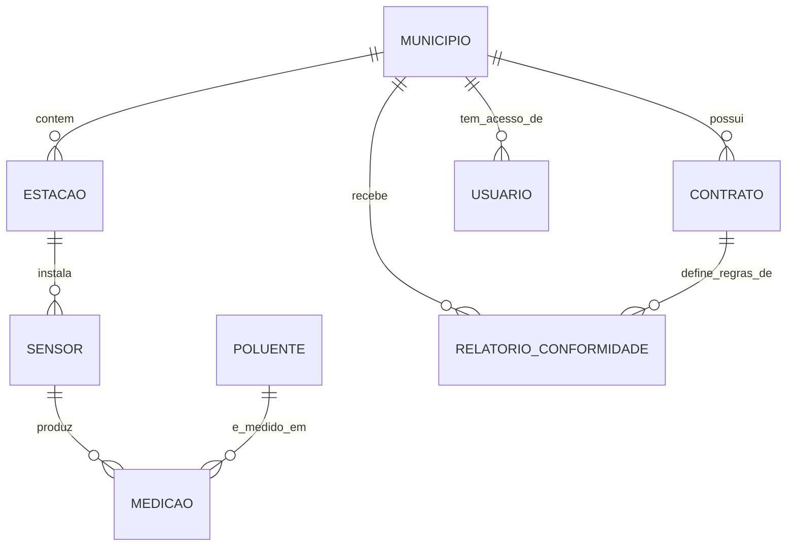

# 02. Modelo Conceitual

Este documento descreve as entidades de negocio da AeroWatch e seus
relacionamentos, deliberadamente sem mencionar nenhuma tecnologia -
o objetivo e que um stakeholder de negocio (ex.: o gestor de
contratos da AeroWatch) consiga validar este modelo sem precisar
entender o que e um data lake ou um star schema.

## Entidades de negocio

- **Municipio**: a prefeitura contratante. Possui um ou mais
  Contratos ao longo do tempo (um contrato pode ser renovado com
  escopo diferente).
- **Contrato**: define o escopo do servico para um Municipio -
  quais poluentes sao monitorados, o SLA de entrega do relatorio, e
  a vigencia. Um Municipio pode ter historico de multiplos
  contratos (ex.: renovacao anual com termos atualizados).
- **Estacao de Monitoramento**: um local fisico dentro do territorio
  do Municipio onde sensores estao instalados. Um Municipio tem
  multiplas Estacoes.
- **Sensor**: um equipamento fisico instalado em uma Estacao, capaz
  de medir um ou mais Poluentes. Um Sensor pertence a exatamente uma
  Estacao.
- **Poluente**: o tipo de substancia monitorada (PM2.5, PM10, O3,
  NO2, CO) - uma lista de referencia compartilhada entre todos os
  Municipios, nao especifica de cada cliente.
- **Medicao**: o evento central do dominio - um Sensor registra o
  nivel de um Poluente em um instante especifico.
- **Relatorio de Conformidade**: um documento periodico (mensal)
  que agrega as Medicoes de um Municipio e verifica aderencia aos
  limites regulatorios definidos no Contrato.
- **Usuario**: uma pessoa com acesso ao sistema - pode ser um
  Operador Municipal (visualiza apenas o proprio Municipio) ou um
  Analista AeroWatch (visualiza todos os Municipios, para fins de
  suporte e auditoria interna).

## Relacionamentos

## Regras de negocio relevantes ao modelo

1. Uma Medicao sempre pertence a exatamente um Sensor e a exatamente
   um Poluente - nao existe medicao "geral" sem um poluente
   especifico associado.
2. Um Sensor pode medir mais de um Poluente (ex.: um sensor
   multi-parametro), mas cada Medicao individual e sempre de um
   unico Poluente por vez.
3. O Contrato, nao o Municipio diretamente, define quais Poluentes
   estao no escopo do Relatorio de Conformidade - um Municipio pode
   ter sensores medindo um poluente que nao faz parte do contrato
   atual (ex.: sensor recem-instalado, ainda nao contratualizado).
4. Um Usuario do tipo Operador Municipal esta associado a exatamente
   um Municipio; um Analista AeroWatch nao esta restrito a nenhum
   Municipio especifico - essa distincao e a base conceitual do
   isolamento multi-tenant (RN1), detalhado tecnicamente no
   [documento 04](04-modelo-fisico.md).

## O que este modelo conceitual nao decide

Este documento nao decide como as Medicoes serao armazenadas
fisicamente, se serao agregadas antes de guardadas, ou qual
tecnologia sera usada - essas sao decisoes dos documentos [03](03-modelo-logico.md)
e [04](04-modelo-fisico.md). O modelo conceitual e propositalmente
estavel: mesmo se a AeroWatch trocar toda a stack tecnica no futuro,
estas entidades e relacionamentos continuam validos.
