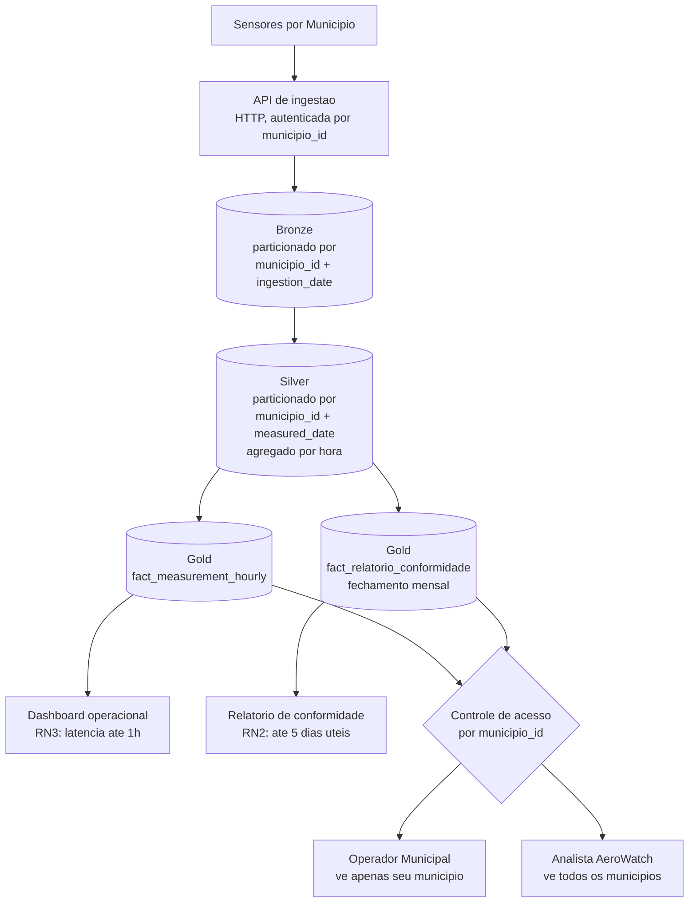

# 05. Arquitetura de Fluxo

## Visao end-to-end

## Descricao das etapas

**1. Ingestao**: cada Municipio envia leituras via API HTTP,
autenticada por credencial que carrega o `municipio_id` do cliente
- essa credencial e o que amarra cada leitura ao tenant correto
desde a origem, nao uma inferencia posterior.

**2. Bronze**: gravacao imutavel, particionada por `municipio_id` e
`ingestion_date` (ver [ADR 0002](https://github.com/amanda-martins-data/adr-arquitetura-dados/blob/main/decisions/0002-particionamento-bronze-ingestion-vs-silver-measured.md)
para o raciocinio geral de particionamento por ingestao vs. evento).
Retencao minima de 5 anos (RN4).

**3. Silver**: validacao (sensor conhecido, valor dentro de faixa
plausivel, poluente pertence ao escopo do Contrato ativo daquele
Municipio) e agregacao de leituras de 5 minutos para o grao horario
usado no Star Schema (documento 03). Particionado por `municipio_id`
e `measured_date`.

**4. Gold**: duas tabelas de fato com ritmos diferentes -
`fact_measurement_hourly` atualiza a cada execucao horaria do
pipeline (RN3); `fact_relatorio_conformidade` e calculada uma vez
por mes, no fechamento, e nao e reprocessada depois (a menos que
uma correcao formal seja necessaria, tratada como excecao auditada,
nao como reprocessamento automatico).

**5. Camada de apresentacao**: o dashboard consulta
`fact_measurement_hourly`; o relatorio de conformidade consulta
`fact_relatorio_conformidade`. Ambos passam pelo controle de acesso
por `municipio_id` antes de qualquer dado ser retornado - a mesma
regra de isolamento vale para as duas superficies de consumo, nao
so uma delas.

## Onde a governanca do Projeto 08 se aplica

Cada dataset deste fluxo (Bronze, Silver, os dois fatos Gold) teria
uma entrada no catalogo de dados nos mesmos moldes do [Projeto 08](https://github.com/amanda-martins-data/governanca-catalogo-dados) -
com uma diferenca importante em relacao ao catalogo do portfolio
original: aqui `sensitivity` para os dados de `dim_municipio` e
`Usuario` seria `personal` de verdade (nome, e-mail, cargo do
Operador Municipal), nao `public` como nos datasets fictícios do
Projeto 08. Isso ativa as bases legais da LGPD documentadas em
[classificacao-dados.md](https://github.com/amanda-martins-data/governanca-catalogo-dados/blob/main/docs/classificacao-dados.md)
na pratica, nao apenas como exercicio teorico.

## Frequencia de execucao

- Pipeline Bronze -> Silver -> `fact_measurement_hourly`: execucao
  horaria (Airflow, DAG unico multi-tenant, ver documento 04).
- Pipeline de fechamento `fact_relatorio_conformidade`: execucao
  mensal, no primeiro dia util do mes seguinte, com folga suficiente
  para entregar o relatorio dentro do prazo de 5 dias uteis (RN2).
